# Creating a GitHub Repository

This guide will show you how to create a GitHub repository for your Unity Club app.

## Prerequisites
* A GitHub account. If you don't have one yet, you can create one [here](https://github.com/join).
* GitHub Desktop. You can install it on your computer [here](https://desktop.github.com/).
* Unity Hub and the latest version of Unity, found [here](https://unity3d.com/get-unity/download).

## Creating a Repo

First things first, you'll need to create a repository on the GitHub website. Git repositories (or repos for short) store the contents of your project online so that you can share your work and easily access it across computers. You can do this by logging into [GitHub](https://github.com/) from your browser and clicking the plus arrow in the top right hand corner of the page and selecting 'New Repository'.

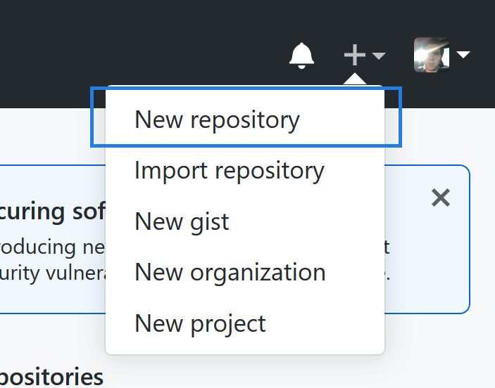

From there, you'll want to do the following.  
1. Give your repository a short name. For example, if your app is a chess app, then you might name the repository **Chess** or **ChessApp**. 
2. Give your repository a short, one sentence description to let people know what it is and what it does.
3. Choose whether to make your repository public or private. It is best to leave this as **Public**. Private repositories will only be visible by you and the people you are working with, and if you do not have a [GitHub pro](https://github.com/pricing) or [educational account](https://help.github.com/en/github/teaching-and-learning-with-github-education/applying-for-a-student-developer-pack), there can only be at most three other people who can access and work on your repository.
4. Make sure to check **Initialize this repository with a README**. This will allow you to easily move the repo to your computer.
5. Select **Unity** for this repo's `.gitignore` file. The `.gitignore` file will keep your project from being cluttered with Unity-specific metadata files that do not need to be included when you share your project with other people.
6. Click **Create repository**.

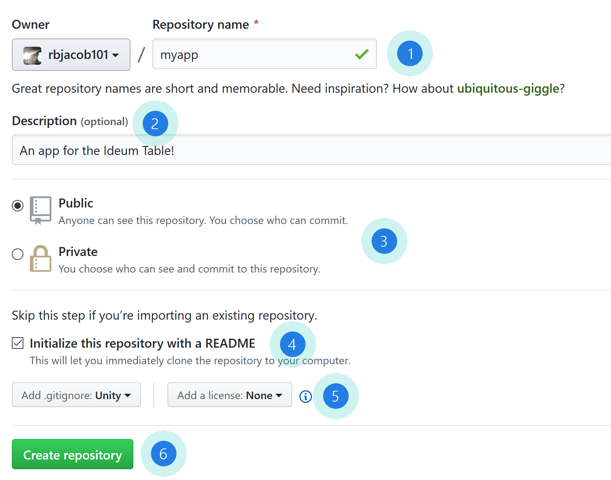

## Inviting Users

Now you have a repository on GitHub. Before moving on, you'll want to make sure to add some collaborators. Head over to the **Settings** page on your repo:

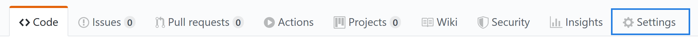

From there, head over to the **Manage access** page:

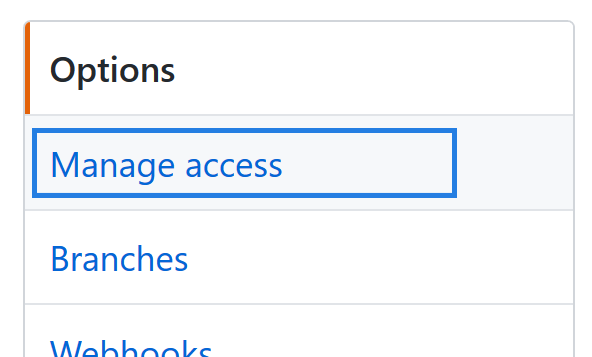

GitHub may ask you to confirm your password. If so, enter it now. On the **Manage access** page, you can invite collaborators to work on your project. You'll want to invite the dedicated Unity Club account, as well as any others that you'd like to work on your project with you. Click **Invite a collaborator**.

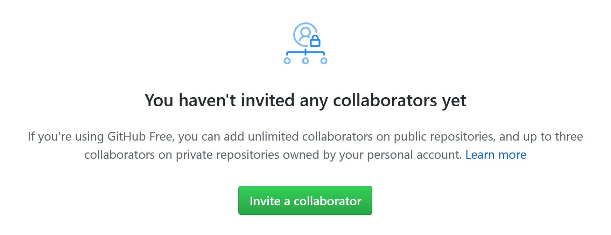

Add the [**unity-club**](https://github.com/unity-club) account as a collaborator. 

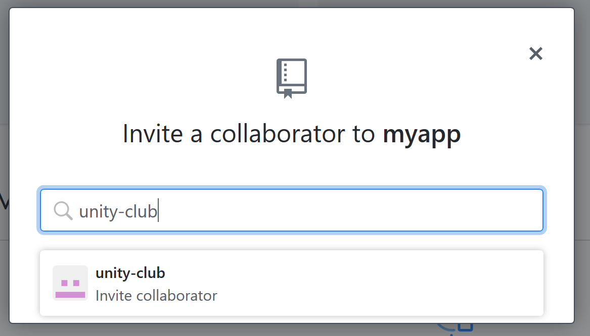

And copy the invite link by clicking the  icon next to the invited user's name.

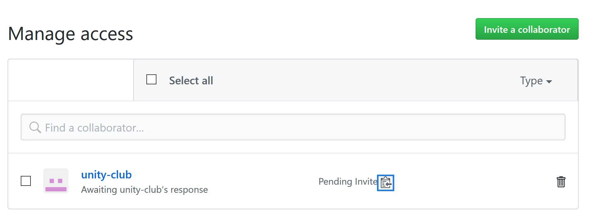

Once you've copied the invite link, send an email to me at [robj210@aa.edu](mailto:robj210@aa.edu) with the invite link. Repeat this process of entering the usernames of your collaborators and sending out invite links for each of the people that you want to help out on your project.

**Note:** Make sure that you are logged in when you accept an invite link to a repository. Otherwise, you won't be able to accept the invitation.

## Downloading the Repository

At this point, you've created a repository on the cloud and invited some collaborators. But you don't actually have any of the repository's files on your computer, and so you'll need to download the repository through GitHub Desktop.

### Opening GitHub Desktop for the first time

If you've never used GitHub Desktop before, follow the steps below to log in and get set up. If you've already used Git or GitHub Desktop, feel free to skip these steps.

Upon launching GitHub Desktop for the first time, you should see a screen like this:


Click **Sign in to GitHub.<span></span>com**. From there, enter your username and password and click **Sign in**.

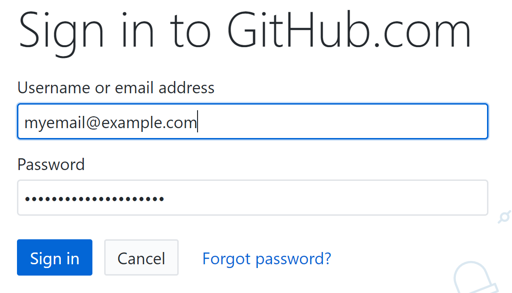

You'll be asked to configure Git. You can leave the Name and Email fields how they are, these will be used to identify who you are when you make updates to your repository. Click **Continue**, and then click **Finish**. 

### Downloading your repository

If this is your first time using GitHub desktop, you should now see a page with multiple options. Choose **Clone a repository from the Internet...** 

If you've used GitHub desktop before, go to **File > Clone repository**.

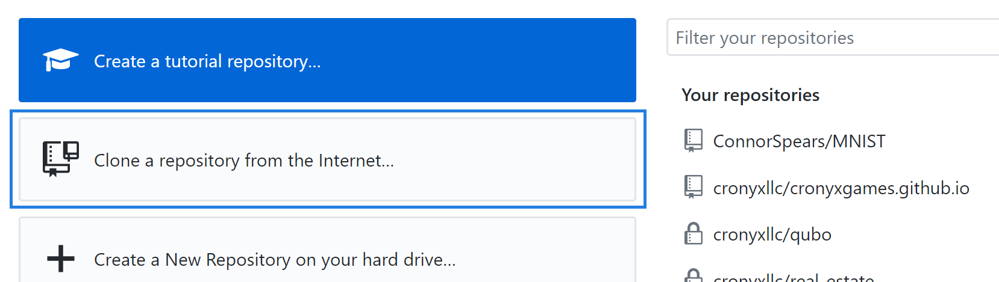


On the **Github.com** tab, you should see a list of your repositories. Choose the repository that you created up above, and optionally choose a location under **Local path** for where the repository should be stored on your computer. If you don't see any repositories listed, hit the  icon. 

If you still do not see your repository, go back into your browser and go to your repository's main page at `https://github.com/[YOUR_USERNAME]/[YOUR_REPOSITORY_NAME]`. Click the green button in the top right that says **Clone or download**, and copy the link to your repository:

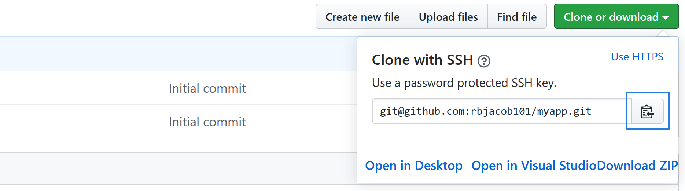

Then, in GitHub desktop, navigate to the **URL** tab in the "Clone a repository" dialog

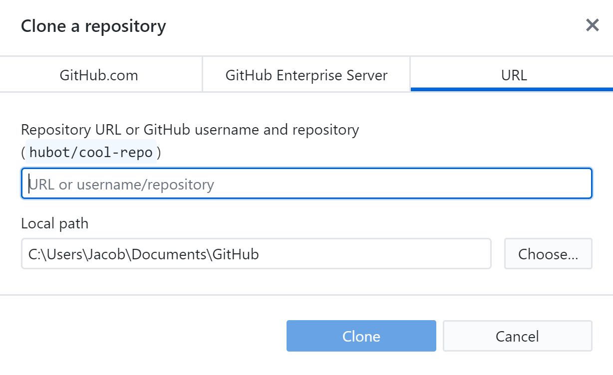

And paste the link you just copied into the field that says **URL or username/repository**.

Now, click the **Clone** button at the bottom of the page. Your repository will be downloaded onto your computer!

## Creating a Unity project inside your repository

Now that you've downloaded your repository to your computer, you'll want to create a new Unity project for your app inside of the repository. To do this, first navigate to the folder where you downloaded your repository. If you don't know where that is, head back into GitHub Desktop, click on your repository in the top left, right click on your repository name, and click **Show in Explorer/View in Finder**. This will go to the location of your repository on your computer. 

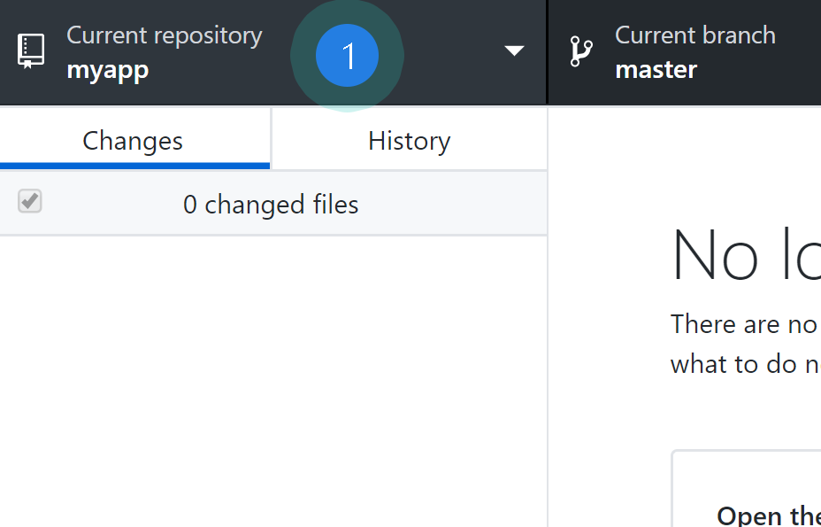
  

Once you have navigated to this folder, create another folder inside of it called `src`. The `src` folder will hold your Unity project inside of it, and will keep your repo's Unity files separate from things like documentation or builds of your app. Your repo folder should look like this now:

```
myrepository/
    src
    .gitignore
    README.md
```

Now that you have a `src` folder in your repository, open up the Unity Hub application. Go to the **Projects** tab on the left hand side, and click **New** in the top right corner:

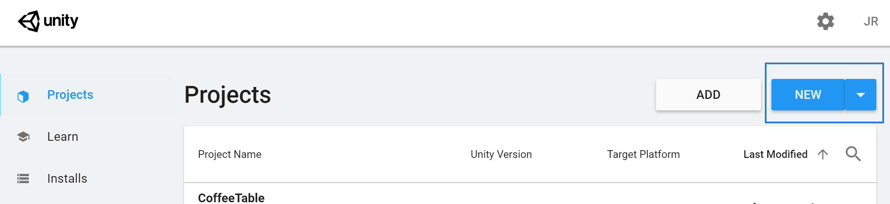

This will open a dialog to create a new project. Leave the project template as **3D**, give your app a fitting name, and set the project's location to the `src` folder that you just created:

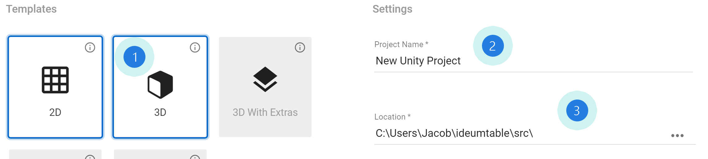

Click **Create**, and unity will generate the project for you in a folder inside the `src` directory. Once the project has been created, you must  move the `.gitignore` file from your repo's root directory into the unity project folder that was just created. The `.gitignore` file will selectively ignore Unity-specific temp files, but only if it is inside the Unity project folder. Your repo should now look like this:
```
myrepository/
    src/
        myunityproject/
            [Contents of your unity project...]
            .gitignore
    README.md
```

 Now you are ready to start developing your app in Unity! But first, you should push your changes to the GitHub.

## Pushing changes to GitHub

Pushing updates to GitHub is very simple with GitHub Desktop. Once you have made a change to your project and you are ready to share it, you can **push** the changes to the server. Pushing your changes allows you to save your work on the cloud, and lets your collaborators see what you've done.

To push your changes, go back into GitHub desktop. Once you've made changes to any files in your project, these changes should appear on the left hand column of the GitHub Desktop window:

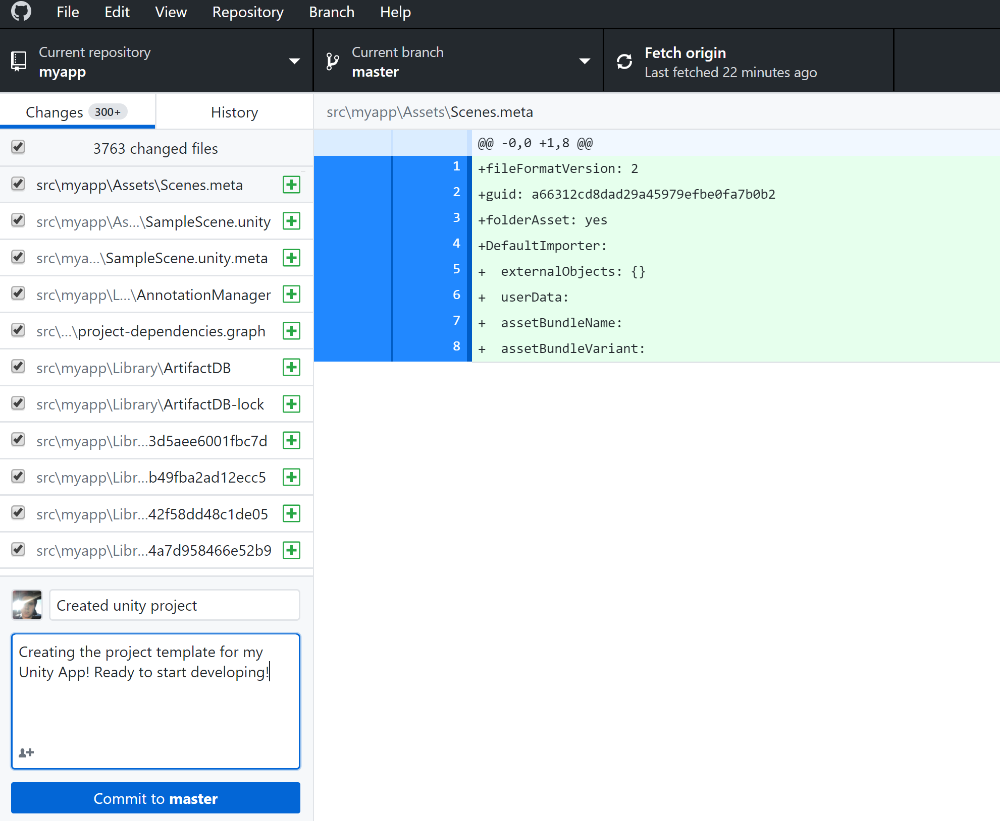

Here, you can select the files you want to upload to GitHub, and see a list of line by line changes that you have made for each of these files on the right hand side of the screen. But before you push your changes, you must **commit** your changes. A **commit** is a batch of changes that you upload to GitHub at a single time. You can push multiple commits at once.

To commit your changes, enter a title for your commit in the bottom left and give your commit a description. Try to be descriptive when you log your commits so that others will know what you've done, and so that you have a log of the changes in your project as you develop it. Hit **Commit to master** to create the commit, and then click on the **Push origin** button at the top right to send your changes to the server.

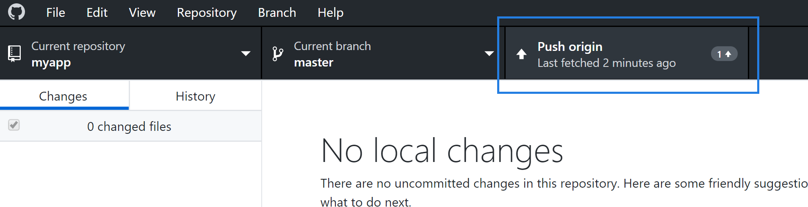

Now you are ready to begin developing your app! Remember to push any time you make progress. Push early, and push often, but never push your project when it is in a broken or buggy state.

## Pulling changes from GitHub

If you are working on a project with multiple people involved, it is wise to **pull** anyone else's changes before you begin working. To pull changes, go back into GitHub Desktop and click **Pull origin**. If you don't see this button, you may have to click **Fetch origin** first.

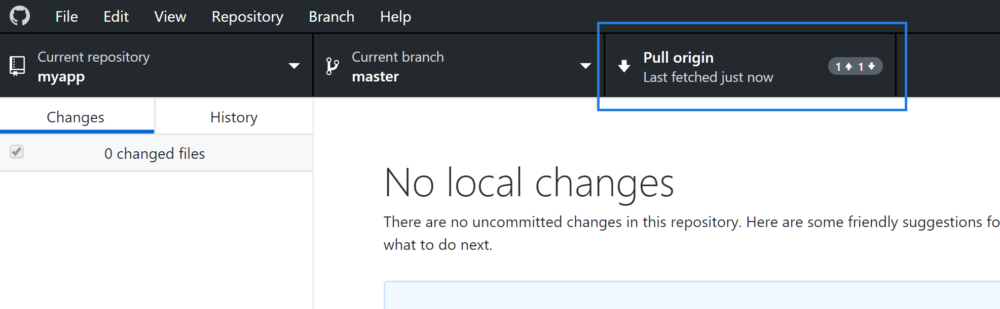

If you are working on a project with multiple people, you should **always** check for other people's changes and pull them first before working. Otherwise, you may run into conflicts down the line if you have made changes that overlap with another person's changes. It is always best to communicate with eachother about who will work on what part of your project at what time.


